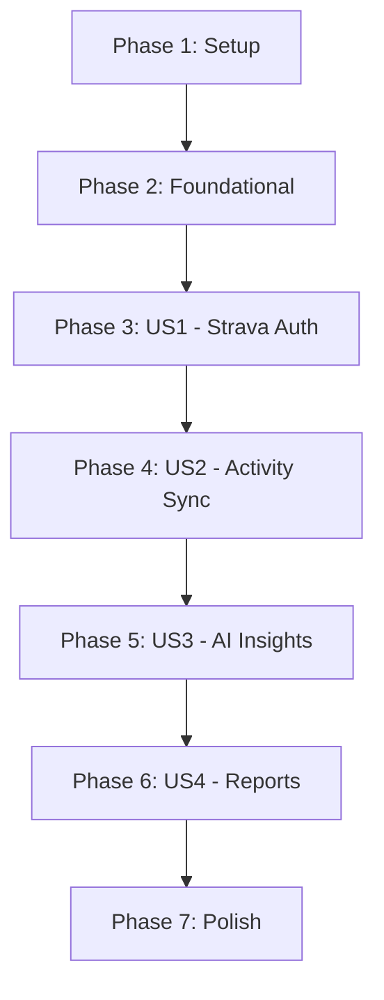

# Tasks: AI Coach Dashboard

**Feature**: AI Coach Dashboard
**Branch**: `001-ai-coach-dashboard`
**Implementation Strategy**: MVP first, focusing on the Strava OAuth2 flow and basic activity sync, followed by AI integration.

## Dependencies & Story Order

## Phase 1: Setup (Project Initialization)
*Goal: Initialize the 3-tier architecture with NestJS and React.*

- [X] T001 Initialize NestJS backend with `nest new backend` in `/backend`
- [X] T002 Initialize React frontend with `npx create-react-app frontend --template typescript` in `/frontend`
- [X] T003 [P] Setup Prisma with SQL Server provider in `/backend/prisma/schema.prisma`
- [X] T004 [P] Configure `.env` with Azure SQL, Strava, and Gemini keys per `/specs/001-ai-coach-dashboard/quickstart.md`
- [X] T005 [P] Setup Tailwind CSS in `/frontend`

## Phase 2: Foundational (Blocking Prerequisites)
*Goal: Implement shared infrastructure and common modules.*

- [X] T006 Implement encryption utility using AES-256-GCM in `/backend/src/common/utils/encryption.util.ts`
- [X] T007 Setup Global Exception Filter and Interceptors in `/backend/src/common/`
- [X] T008 [P] Configure Azure SQL Database connection in `/backend/src/database/`
- [X] T009 [P] Setup React Query and Zustand in `/frontend/src/store/`

## Phase 3: [US1] Strava OAuth2 Integration
*Goal: Enable users to connect their Strava accounts.*

**Independent Test**: User can click "Connect with Strava", authorize, and be redirected back with a valid JWT.

- [X] T010 [P] [US1] Create User and StravaToken models in `/backend/prisma/schema.prisma`
- [X] T011 [US1] Implement StravaAuthService for token exchange in `/backend/src/auth/strava-auth.service.ts`
- [X] T012 [US1] Implement `/auth/strava/callback` endpoint in `/backend/src/auth/auth.controller.ts`
- [X] T013 [P] [US1] Create Login page with Strava button in `/frontend/src/pages/Login.tsx`
- [X] T014 [US1] Implement JWT strategy for authenticated requests in `/backend/src/auth/jwt.strategy.ts`

## Phase 4: [US2] Activity Data Sync
*Goal: Fetch and store run activities from Strava.*

**Independent Test**: After login, the database contains the user's latest run activities.

- [X] T015 [P] [US2] Create Activity model in `/backend/prisma/schema.prisma`
- [X] T016 [US2] Implement StravaApiService to fetch activities in `/backend/src/strava/strava-api.service.ts`
- [X] T017 [US2] Implement ActivitySyncService with upsert logic in `/backend/src/activities/activity-sync.service.ts`
- [X] T018 [US2] Implement `/activities` and `/activities/sync` endpoints in `/backend/src/activities/activities.controller.ts`
- [X] T019 [P] [US2] Create ActivityList component in `/frontend/src/components/ActivityList.tsx`

## Phase 5: [US3] AI Coaching Insights
*Goal: Generate and display personalized insights using Gemini.*

**Independent Test**: Clicking an activity shows 3 blocks of insights (Praise, Improvement, Warning) in Vietnamese.

- [X] T020 [P] [US3] Create Insight model in `/backend/prisma/schema.prisma`
- [X] T021 [US3] Implement GeminiApiService with structured JSON prompt in `/backend/src/ai/gemini-api.service.ts`
- [X] T022 [US3] Implement InsightService to manage AI generation and caching in `/backend/src/ai/insight.service.ts`
- [X] T023 [US3] Implement `/activities/:id/insight` endpoint in `/backend/src/ai/ai.controller.ts`
- [X] T024 [P] [US3] Create InsightCard component in `/frontend/src/components/InsightCard.tsx`
- [X] T025 [US3] Implement ActivityDetail page in `/frontend/src/pages/ActivityDetail.tsx`

## Phase 6: [US4] Monthly Reports & Trends
*Goal: Provide a high-level summary of performance.*

**Independent Test**: Monthly report shows total distance and an AI-generated trend summary.

- [X] T026 [US4] Implement MonthlyReportService in `/backend/src/reports/monthly-report.service.ts`
- [X] T027 [US4] Implement `/reports/monthly` endpoint in `/backend/src/reports/reports.controller.ts`
- [X] T028 [P] [US4] Create Reports page with Recharts integration in `/frontend/src/pages/Reports.tsx`

## Phase 7: Polish & Cross-Cutting Concerns
*Goal: Ensure security, performance, and responsive design.*

- [X] T029 Implement Row-Level Security checks in all backend services
- [X] T030 Add loading states and error boundaries in `/frontend`
- [X] T031 Optimize mobile responsiveness for Dashboard and Activity Detail
- [X] T032 Final E2E test run with Playwright in `/test/e2e/`

## Parallel Execution Examples

- **Auth & UI**: T011 (Service) and T013 (Login Page) can be done in parallel.
- **Data & AI**: T016 (Strava Fetch) and T021 (Gemini Prompt) can be done in parallel.
- **Reporting**: T026 (Backend) and T028 (Frontend Charts) can be done in parallel.
